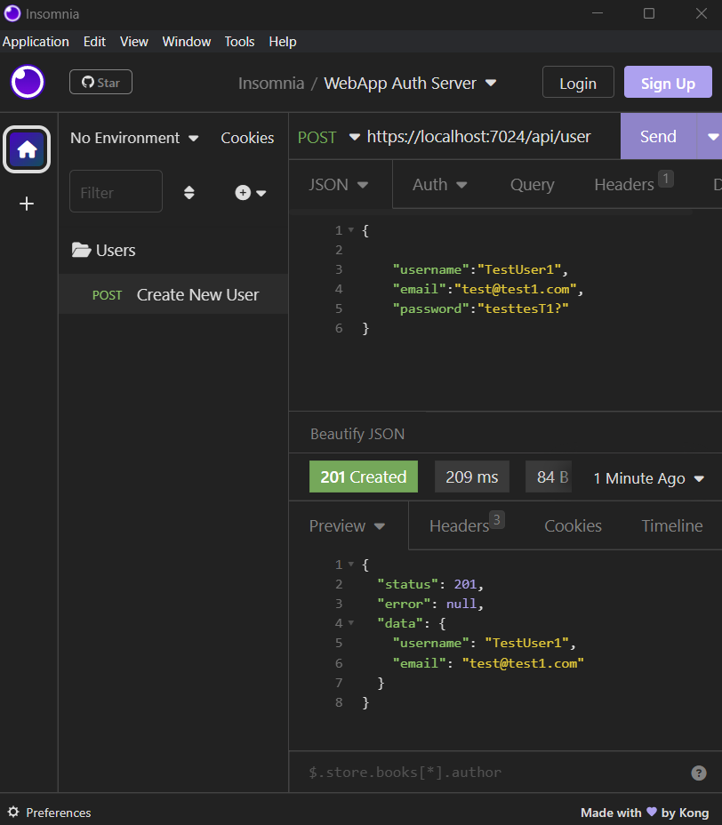

# Web-App Authentication Server

## _Coming Soon_

---

The Web App Authentication Server is written in C#, securely authenticates users for all your applications.

## Features

- HTTPS by default
- **_MongoDB_** for data persistence.
- Passwords are not stored in plain text.
- All fields are validated prior to model mutation.
- Acts as a SSO for your family of connected applications.
- **_JSON Web Tokens_** are used for claim and session management.

While this project can be reused, it is purposefully created to act as an authentication microservice for my projects and personal applications.


## Table of Contents

[Installation](#installation)

[Usage](#usage)

[Screenshot](#screenshot)

[Demo](#demo)

[Contact](#contact)

[License](#license)

## Installation

_`To build a local copy`_:

1. **Clone the repo**:

- Navigate to a directory where you would like to save this project and clone the repository:

  ```bash
  git clone https://github.com/iiTONELOC/web-app-auth-server.git
  ```

2. **Ensure you have MongoDB, Mongosh, and the DotNET SDK installed on your system**:

- Covering the installation steps for these prerequisites is beyond the scope of this README, use the links below to find the relevant installation instructions for your system.

- [_Download MongoDB Community_](https://www.mongodb.com/try/download/community)

  - [_MongoDB Installation Guides_](https://www.mongodb.com/docs/manual/installation/#mongodb-installation-tutorials)

- [_Download Mongosh_](https://www.mongodb.com/try/download/shell)

  - [_Mongosh_](https://www.mongodb.com/docs/mongodb-shell/install/)

- [_DotNET Download Link_](https://dotnet.microsoft.com/en-us/download)

  I recommend having both versions but the 6.0 SDK will be needed for this project.

  - [_DotNET Installation Guides - Windows_](https://learn.microsoft.com/en-us/dotnet/framework/install/)

  - [_DotNET Installation - Linux_](https://learn.microsoft.com/en-us/dotnet/core/install/linux)

  - [_DotNET Installation - macOS_](https://learn.microsoft.com/en-us/dotnet/core/install/macos)

3. **Create your environment variables**:

   ```bash
   cd web-app-auth-server

   # Create the empty JSON file
   # Windows Powershell
   New-Item .env -ItemType file

   # Mac or Linux
   touch .env
   ```

4. **Add your desired settings**

   Copy the below settings to the newly created .env file and
   Replace `<Whatever>` with your information

   ```env
   ConnectionString = <MongoConnectionString>

   # pick existing or make up your own
   DatabaseName = <DBName>

   # pick existing or make up your own
   WebAppCollectionName = <WebAppCollectionName>

   # pick existing or make up your own
   UserCollectionName = <UsersCollectionName>

   AllowedHosts = <List of Hosts>
   JWTUserKey1 = <256-Bit URL-Safe Secret>
   ```

5. **Configure Mongo using Mongosh**:

   Open a new terminal and bring up the Mongosh Shell:

   ```bash
   mongosh

   #create a database using the DatabaseName from the app settings
   use <DatabaseName>

   #create the WebApp and User Collections using the names from the app settings
   db.createCollection('<WebCollectionName>')
   db.createCollection('<UserCollectionName>')

   #exit mongosh
   exit

   #close terminal
   exit
   ```

6. **Build the project**

   ```bash
   dotnet build
   ```

7. **Run the development server**

   ```bash
    dotnet run
   ```

## Usage

The Web Authentication Sever acts as a central datastore for your connected applications and accepts JSON.

User JSON data must adhere to the following specifications to interact with the API :

### Data Requirements

```json
// UserModel Schema
{
    "_id": String,
    "username": String!,
    "password": String!,
    "email": String!
}
```

`Usernames` must meet the following conditions:

- Must be an alpha-numeric string
- Be between 3 and 20 characters
- Cannot contain white-space
- Must be unique

`Passwords` must meet the following conditions:

- Must be a string
- Must be between 8 and 20 characters
- Cannot contain white-space
- Must have one uppercase letter
- Must have one lowercase letter
- Must have a number
- Must have a special character:
  `` !@#$%^&*)}[|/.+=}(]?_~`-;: ``

`Email Addresses` must meet the following conditions:

- Must be a string
- Must be less than 150 characters
- Must be a valid email address
- Must be unique

## Screenshot



_Image demonstrates successfully creating a user from the `api/user` endpoint_

## Demo

Coming Soon!

## Contact

If you have any questions about this project or wish to connect please feel free to send me an email! [AnthonyTropeano@protonmail.com](mailto:AnthonyTropeano@protonmail.com)

## LICENSE

This project is licensed by the MIT license and a copy can be found here: [click to view license agreement](./LICENSE).
